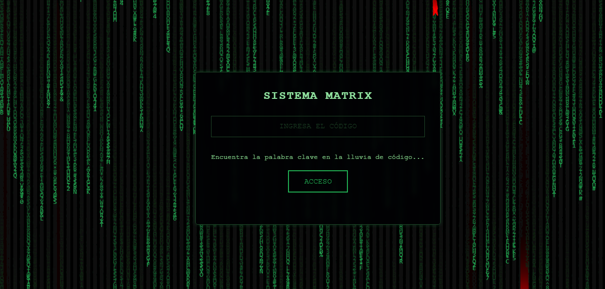
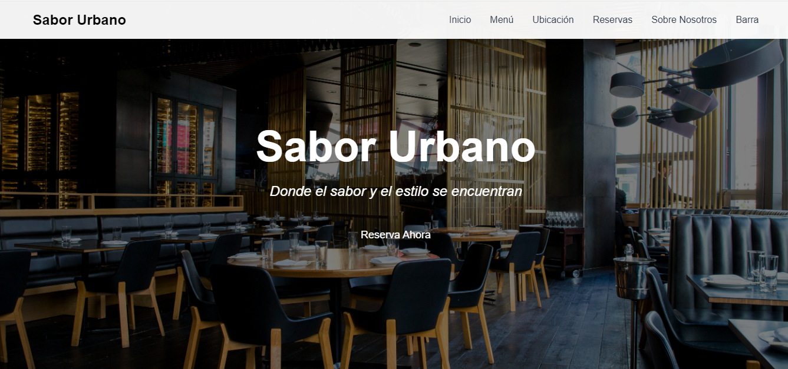
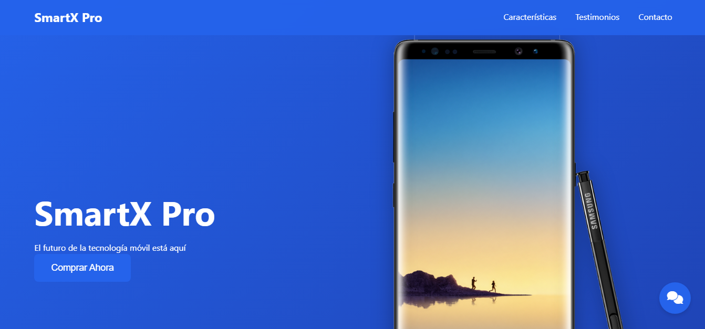

<div align="center">
  
# 👨‍💻 ¡Hola Mundo Digital! 

[](https://git.io/typing-svg)


---


### 🛡️ Sobre mí

```javascript
const developer = {
    role: "Front-End Developer & Security Tech",
    code: ["JavaScript", "HTML", "CSS", "React", "Vue", "Angular"],
    passion: ["UI/UX", "Cybersecurity", "Clean Code"],
    currentFocus:"Creando experiencias web seguras y elegantes"
};
```

<iframe width="560" height="315" src="https://www.youtube.com/embed/ID_DEL_VIDEO" frameborder="0" allowfullscreen></iframe>


---

### 🔧 Stack Tecnológico

<div align="center">

#### Frontend


#### Seguridad


#### Herramientas


</div>

---

### 🚀 Proyectos Destacados

<table>
  <tr>
    <td align="center" width="33%">
      <a href="https://franjavacisco.github.io/Agent_Smith/">
        
        <br />
        <b>🔐 Agent_Smith</b>
      </a>
      <br />
            <div style="border: 2px solid black; padding: 10px;">
            Agent_Smith es un Matrix Login Simulation un proyecto interactivo inspirado en el universo de "The Matrix", diseñado para simular una experiencia visual inmersiva de lluvia de código combinada con un sistema de autenticación ficticio.
                  </div>
    </td>
    <td align="center" width="33%">
      <a href="https://github.com/FranJavacisco/Sabor_Urbano">
        
        <br />
        <b>🥂 Sabor Urbano</b>
      </a>
      <br />
      "Sabor Urbano" es un sitio web moderno y responsivo que conecta a los usuarios con el restaurante. Ofrece funciones como consulta de menú, reservas online, horarios, contacto y suscripción a ofertas, mejorando la experiencia digital y facilitando la interacción.
    </td>
    <td align="center" width="33%">
      <a href="https://franjavacisco.github.io/Landing_Page/">
        
        <br />
        <b>📱 Landing_Page</b>
      </a>
      <br />
      <div style="border: 2px solid black; padding: 10px;">
            Landing page interactiva diseñada con JavaScript moderno. Incluye animaciones de scroll, chat simulado, modal de oferta, navegación sticky, efectos parallax, microinteracciones y más. Optimizada para rendimiento y mantenibilidad con una estructura modular y código limpio.
            </div>
    </td>
  </tr>
</table>

---

### 💭 Filosofía de Desarrollo

> *"La seguridad no es solo una capa más, es el fundamento de una experiencia de usuario excepcional"*

```typescript
function developerPhilosophy() {
    return {
        clean_code: true,
        security_first: true,
        user_experience: "priority",
        continuous_learning: "always"
    };
}
```

---

### 🎯 Intereses & Hobbies

- 🔍 CTF Challenges
- 📚 Bug Bounty Hunting
- 🎮 Game Security Testing
- 🌱 Contribuciones Open Source

---

### 📫 Conectemos

<div align="center">
  
[](TU_LINKEDIN)
[](TU_TWITTER)
[](TU_PORTFOLIO)

</div>

<div align="center">

### 🤝 ¿Interesado en colaborar?

[](mailto:TU_EMAIL)

</div>

---

<div align="center">
  

[](https://github.com/TU_USUARIO)

</div>
